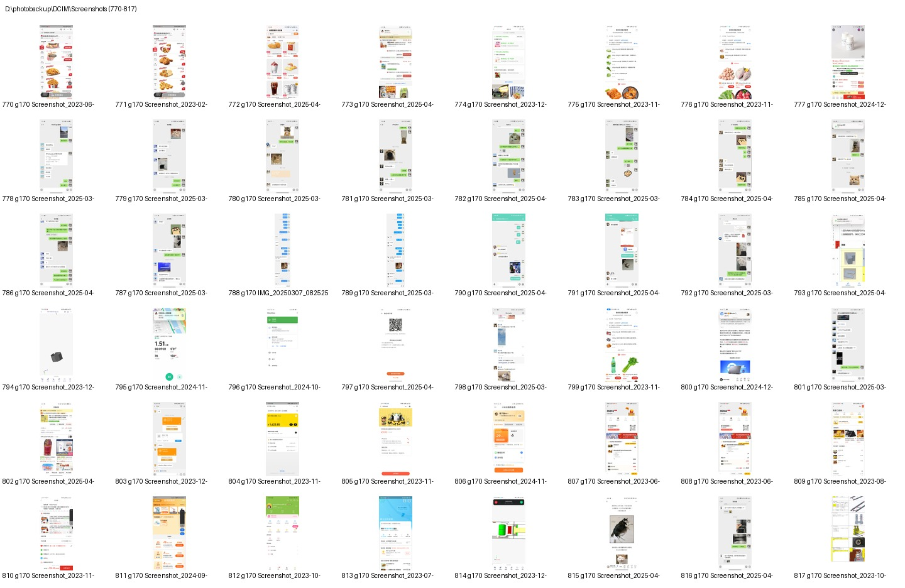
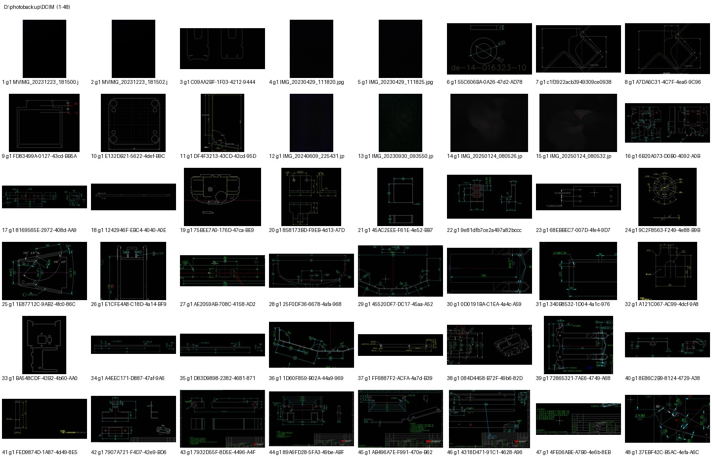
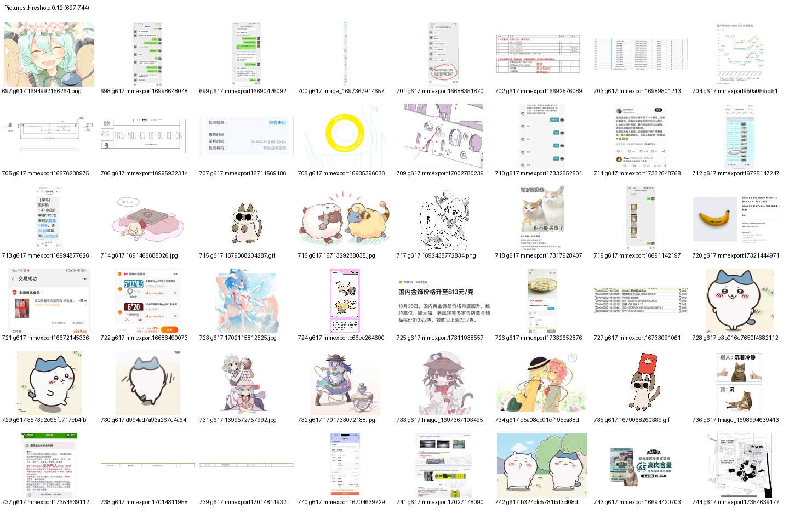

# LumaOrder

LumaOrder 是一个本地图片相似度排序重命名工具。它会递归扫描指定目录，把每个含图片的子目录独立排序，默认只生成 CSV 预览清单；只有明确执行 `--apply` 或在 Web UI 中确认 Apply 后，才会原地重命名文件。

## 功能

- 支持任意 root 目录，递归扫描，包括隐藏目录。
- 默认排除 `review_samples`，可重复指定更多排除目录。
- 支持 `.jpg/.jpeg/.png/.webp/.bmp/.gif/.tif/.tiff`，GIF 默认取第一帧。
- 忽略原始尺寸：读取图片后按 EXIF 方向纠正，再缩放到固定尺寸提取特征。
- 视觉相似排序：灰度结构特征、8x8 空间颜色布局、粗略颜色直方图。
- 每个目录单独聚类和排序，组内用最近邻顺序让相似图片尽量连续。
- 重命名格式可配置，例如 `0001_原文件名.jpg`。
- dry-run 输出 CSV；apply 使用短 `.tmp` 临时名做两阶段重命名。
- 可生成 start/middle/end 抽查联系表，便于快速检查排序效果。
- 提供 Python CLI 和无 Flask/FastAPI 依赖的本地 Web UI。

## 安装

```powershell
cd <project-root>
python -m pip install -r requirements.txt
python -m pip install -e .
```

也可以不安装 editable 包，直接在当前 PowerShell 会话中设置：

```powershell
$env:PYTHONPATH = (Resolve-Path .\src).Path
```

## CLI

预览，不改名：

```powershell
python -m glass_image_sorter.cli <photos-root> --dry-run --output preview.csv
```

如果已经执行 `python -m pip install -e .`，也可以使用命令别名：

```powershell
lumaorder <photos-root> --dry-run --output preview.csv
```

执行原地重命名：

```powershell
python -m glass_image_sorter.cli <photos-root> --apply --output result.csv
```

生成抽查联系表：

```powershell
python -m glass_image_sorter.cli <photos-root> --dry-run --contact-sheets review_samples
```

如果联系表目录放在扫描 root 内，建议使用默认排除名 `review_samples`，或同时传入 `--exclude-dir 联系表目录名`，避免下一次 apply 时把联系表也当作普通图片排序重命名。

常用参数：

- `--threshold auto|数字`：默认 `auto`，手动数字必须是有限且大于等于 0。
- `--exclude-dir NAME`：额外排除目录名，可重复。`review_samples` 默认排除。
- `--strip-existing-prefix`：默认开启，避免重复运行后生成 `0001_0001_...`。
- `--keep-existing-prefix`：保留已有数字前缀。
- `--prefix-width N`：序号位数，默认 4。
- `--contact-sheets DIR`：生成每个目录的 start/middle/end JPEG 抽查图。

## Web UI

启动：

```powershell
cd <project-root>
python -m glass_image_sorter.web --port 8765 --open
```

或使用命令别名：

```powershell
lumaorder-web --port 8765 --open
```

浏览器打开：

```text
http://127.0.0.1:8765
```

页面第一屏就是工具操作台，包含 root 路径、阈值、排除目录、序号位数、CSV 输出、联系表输出、进度日志、结果摘要和示例图入口。Apply 按钮在 dry-run 成功且无冲突后才启用；修改任意参数后需要重新 dry-run。

## Web API

- `POST /api/jobs`：创建 dry-run 或 apply job。
- `GET /api/jobs/{id}`：返回状态、进度、摘要、错误。
- `GET /api/jobs/{id}/artifacts`：返回 CSV 和联系表路径。
- `GET /examples`：返回项目内置示例图列表。

创建 dry-run job 示例：

```json
{
  "root": "<photos-root>",
  "mode": "dry-run",
  "threshold": "auto",
  "excludeDirs": ["review_samples"],
  "prefixWidth": 4,
  "stripExistingPrefix": true,
  "output": "<photos-root>/preview.csv",
  "contactSheets": "<photos-root>/review_samples"
}
```

## 安全机制

dry-run 只写 CSV，不改名。apply 前会检查目标文件名冲突：如果目标路径已被不相关文件占用，程序停止并报告，不覆盖文件。

apply 使用两阶段重命名：

1. 先把所有待改名文件移动到短 `.rename_tmp_<token>_<index>.tmp` 临时名。
2. 再从临时名移动到最终文件名。
3. 如果第二阶段失败，已完成的最终重命名会先退回临时名，再退回原文件名。

这个流程支持同目录内互换文件名和循环重命名，并尽量避免半完成状态。

## 算法说明

工具提取的是轻量视觉特征，不是语义识别模型。它更擅长把整体视觉近似的图片排在一起，例如同一场景、同一截图系列、相近构图或颜色布局。它不会理解“人物是谁”“地点是什么”“照片含义是什么”。

特征由三部分组成：

- `12x12` 灰度结构：捕捉整体明暗和构图。
- `8x8` RGB 空间布局：区分全局颜色相同但上下左右布局不同的图片。
- `4x4x4` 粗颜色直方图：捕捉主要颜色分布。

每个目录内先按自动或手动阈值聚类，再按聚类顺序排序；组内使用最近邻路线，让相似图片尽量连续。

## 样例

项目只保留少量联系表到 `docs/examples`，用于 Web UI 示例列表和 README 预览，不复制完整样例集。







## 开发测试

```powershell
cd <project-root>
python -m unittest discover -s tests
```

测试覆盖：

- 尺寸变化不影响特征。
- 空间颜色布局能区分全局颜色相同但布局不同的图片。
- 非法阈值、缺失 root、非目录 root 的错误处理。
- dry-run 不改名；apply 正确重命名；冲突时不覆盖。
- 第二阶段重命名失败回滚。
- `review_samples` 默认排除。
- 联系表生成和 JPEG 可打开性。
- Web API dry-run job、冲突 apply 拒绝、示例列表。
